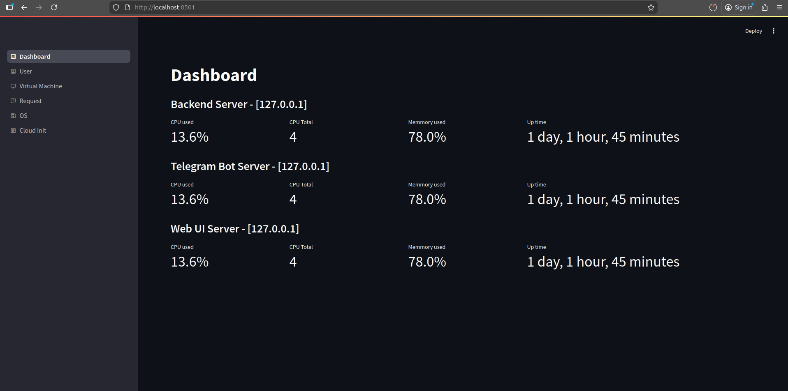
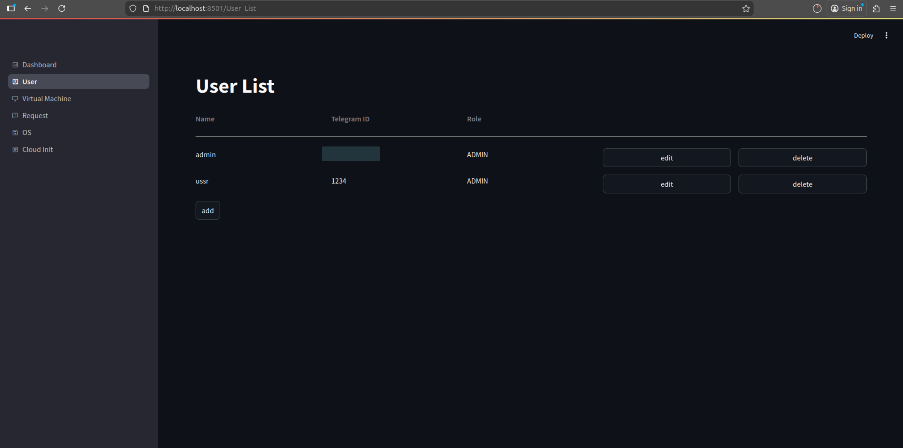
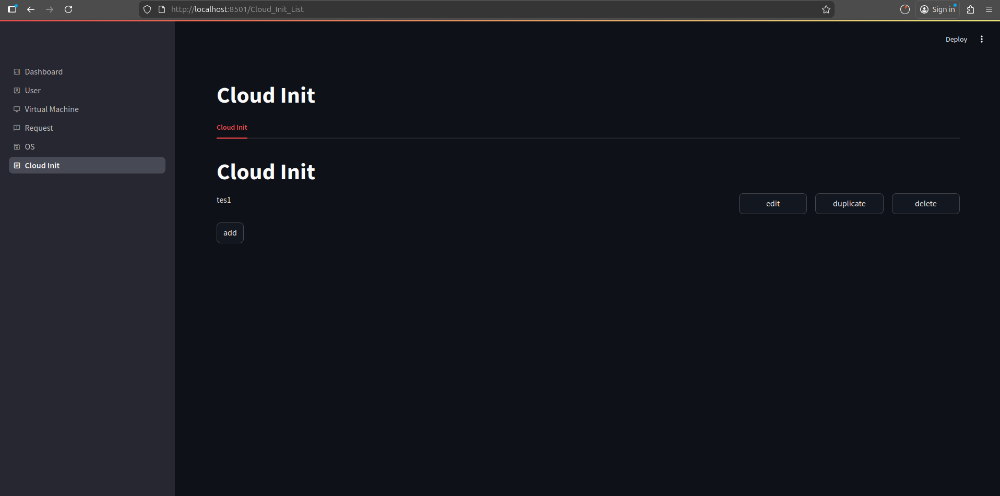
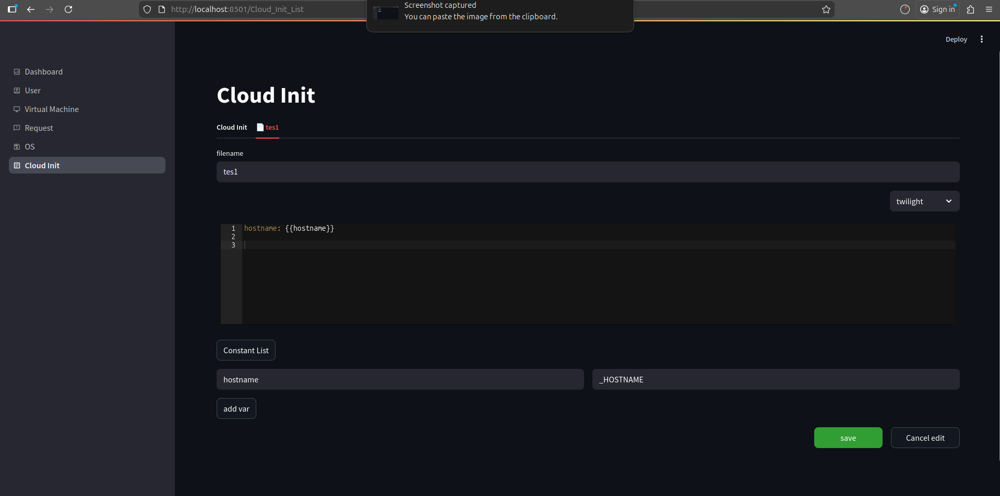
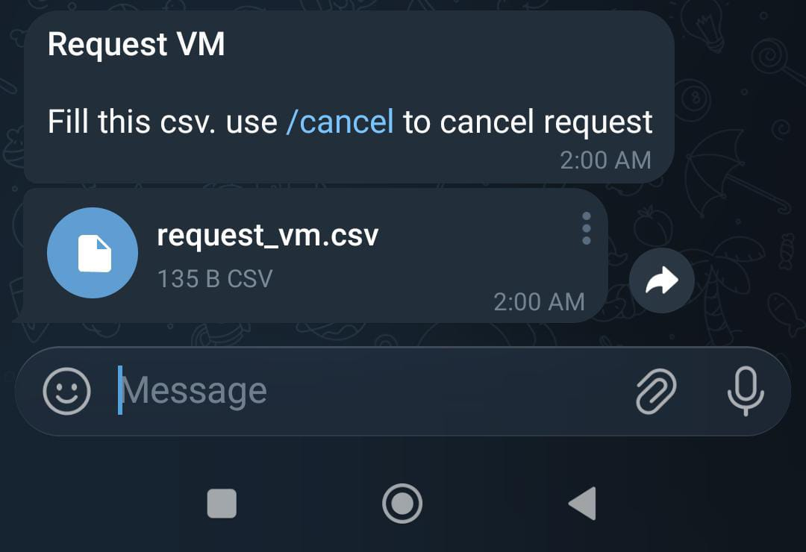
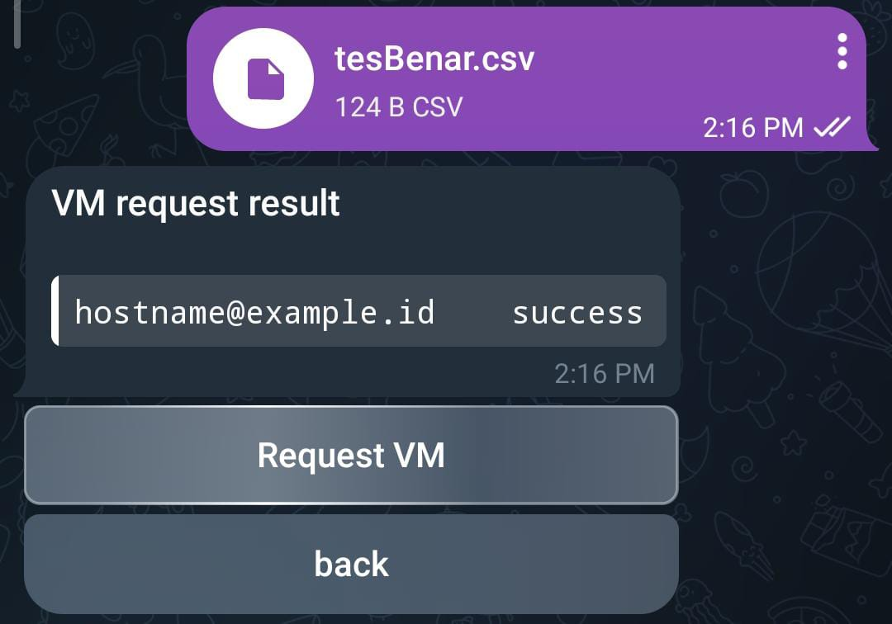
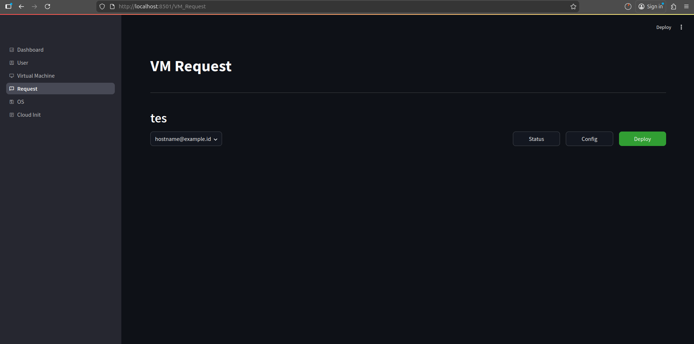

# KVM Manager

Automate KVM virtual machine provisioning using CSV to store VM request list that through telegram bot and admin approval on web UI. The configuration injected using cloud-init on deployment process.

## Requirement
- Linux OS (test on ubuntu, possibly run on any distro that have genisoimage, or you can change manually how to generate cloud-init.iso in `./backend/lib/vm_utility.py`)
- dependency :
    - python3
    - python3 devel
    - python3 pip
    - ssh
- backend dependency :
    - genisoimage
    - ssh

## Installation & Start service :
1. Configure config.yaml
2. Initialize the service :
    `./kvm-manager.py init`
3. to run the service :
    `./kvm-manager.py start <service|all>`
4. to check the service status :
    `./kvm-manager.py status <service|all>`
5. to run the service :
    `./kvm-manager.py stop <service|all>`
5. After start the web, make sure to change the user_id of the admin to the user_id of your telegram.

## Web UI
1. metrics dashboard

2. user page

3. cloud init



## Request vm
1. Check telegram bot send anything. click `request VM` we will got this message :

2. fill the csv and send back :

3. Request will appearn on web ui and waiting approval :


## Version Note & Next development:
- Deployment on `virt-install` using `--os-variant generic`, can be improved by adding column variant on table os that has default value : generic.
- Need to add monitoring to update vm status (simultanously ping | by request on refresh page)
- Need improvement on telegram bot interface.
- Need to test on separate host for each service
- This project only work on ubuntu beacuse it depend on :
    ```
    genisoimage
    ```
